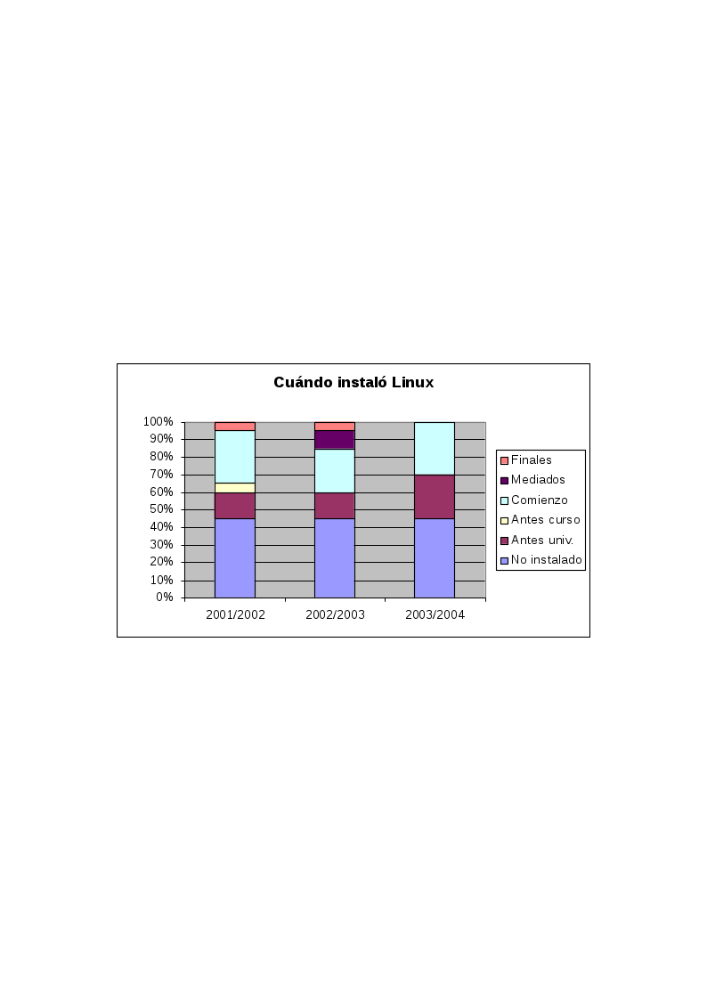
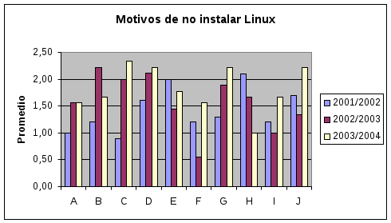
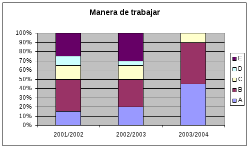
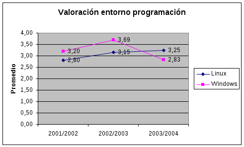
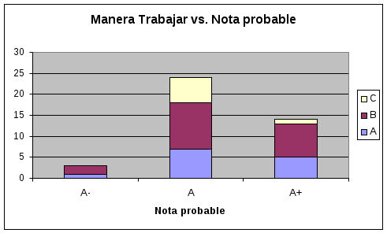

# Migración a SL en la enseñanza de la programación [^1]
[^1]: Este trabajo fue presentado en el [I Congreso de las Tecnologías del Softaware Libre](https://dialnet.unirioja.es/servlet/libro?codigo=476932) (La Coruña, 2005)

__Patricio García Báez__

__Dpto. de Estadística, I.O. y Computación__

__Universidad de La Laguna__

__38271 La Laguna, S/C Tenerife__

__e-mail:__ ``pgarcia AT ull.es``

## Migración a software libre

### Antecedentes

Hasta el curso 2000/2001 las prácticas de las asignaturas venían impartiéndose sobre el sistema operativo MS-DOS haciendo uso del los compiladores de la casa Borland: TurboPascal y BorlandPascal, para las asignaturas de primer curso, y BorlandC y TurboC para las de segundo curso. Ello suponía las siguientes dificultades:

* El MS-DOS en la ETSII iba a dejar de mantenerse.
* Borland no se planteaba seguir sacando nuevas versiones de compiladores para MS-DOS, sino aconsejaban pasarse a Delphi o C++Builder bajo entorno Windows.
* La exclusividad de los compiladores usados a una sola plataforma hacía que en posteriores asignaturas el alumno tuviera que aprender otras herramientas de desarrollo.
* Al ser herramientas de pago, si el alumno deseaba trabajar en su casa necesitaba adquirir el producto o trabajar con copias ilegales.

Las opciones que se barajaron era migrar hacia un entorno GNU/Linux o bien hacia un entorno Windows. Además se contaba con la dificultad de que en las aulas de informática habían muchos ordenadores con bajas prestaciones, que bajo MS-DOS y GNU/Linux podrían seguir trabajando, pero que carecían de recursos para la versión de aquellos momentos de Windows (NT workstation). Esto junto al hecho de que con Windows no se resolvían las dos últimas dificultades de la lista anterior y a las ventajas de SL decantaron que los profesores eligieran GNU/Linux como plataforma de trabajo.

La migración en la ETSII arrastró también migraciones en las otras titulaciones, principalmente debido a que compartían profesores y aulas con la ETSII.

### Herramientas elegidas

Las herramientas de trabajo elegidas fueron por tanto:

* GNU/Linux como sistema operativo.
* Compilador Free Pascal [5], para las asignaturas de primer curso, ya que mantenía la compatibilidad con los productos de Borland y podía ejecutarse en el resto de plataformas de la ETSII.
* Compilador GNU gcc (C y C++) para las asignaturas de segundo curso.
* Editor Xemacs [6], debido a su potencia para la edición de programas y su capacidad de trabajar con múltiples lenguajes, herramientas y plataformas.
* Entorno depurador DDD [7], que permitía su uso también con múltiples lenguajes.

### Acciones de apoyo

Para detectar posibles dificultades en la migración durante los finales de lostres últimos cursos se ha distribuido entre los alumnos una encuesta [8] sobre la implantación del nuevo entorno de desarrollo. Entre las principales dificultades detectadas tanto entre alumnos como profesores pudieron destacarse:

* Falta de formación de algunos profesores en dicho entorno de desarrollo.
* Escasa familiarización también en el sistema operativo GNU/Linux, tanto de profesores como de alumnos.
* Dificultades para la instalación y configuración del entorno de trabajo.

Para paliar los efectos de estas dificultades se llevaron a cabo las siguientes acciones:

* Organización de seminarios para profesores: en ellos, los profesores que ya contaban con experiencia en el nuevo entorno de desarrollo adiestraban a los recién llegados y servían como apoyo en las tareas de instalación y configuración de herramientas.
* Organización de cursos de GNU/Linux y fiestas de instalación: en estos cursos y fiesta los propios alumnos de cursos superiores enseñan a sus compañeros recién llegados a la ETSII.
* Refuerzo en el temario de la parte dediacada a la introducción del sistema operativo y su entorno: se incrementó de un 16% a un 20%, aumentando el número de prácticas tuteladas de dos a tres.
* Creación de foros de discusión a través de internet: así se solventan dudas sobre el entorno de trabajo, que son respondidas por los propios alumnos y profesores.
* Insistir en la posibilidad de utilizar las herramientas de desarrollo también bajo el entorno Windows: esto permitía a los alumnos menos avezados la realización de las prácticas en sus casas sin necesidad de instalar GNU/Linux.

### ETSII::Live Guachinche

Otra iniciativa que se ha llevado es conducente a paliar las dificultades que se encuentran los alumnos en la instalación de un entorno informático de trabajo, que incluya las aplicaciones utilizadas para la realización de prácticas. Esta tarea se encuentra agravada por los escasos conocimientos de los alumnos en administración de sistemas informáticos. Para ello en el presente curso se ha distribuido a cada alumno un CD Rom que contiene una distribución de GNU/Linux que denominamos ETSII::Live Guachinche [9]. Entre las características destacables está la inclusión de todas las aplicaciones de SL que se necesitan en el desarrollo de sus asignaturas, y que es posible arrancar dichas aplicaciones sin necesidad realizar ninguna instalación en el disco duro, pudiendo por tanto trabajar con ella en cualquier PC. Además dispone de una utilidad que permite instalarlo en el propio ordenador, con lo que se agiliza su uso.

La creación de esta distribución se ha llevado a cabo por los propios alumnos de cursos superiores de la ETSII, eligiendo las aplicaciones a incluir según las necesidades expresadas por los propios alumnos y los profesores. Durante su desarrollo se han utilizado las herramientas propias de gestión de proyectos en SL [Referencia], participando una gran parte de la comunidad universitaria en proponer sugerencias y validar las versiones previas. Además los propios alumnos y profesores a través de su portal web dan soporte a sus compañeros en todo lo referente a instalación, configuración y uso de este CD.

Esta iniciativa ha tenido muy buena acogida dentro de la ETSII y su entorno, agotándose las 500 copias disponibles en apenas dos días. El foro de soporte almacena unas 70 preguntas y respuestas, actualmente se mantiene una lista donde se recogen sugerencias para futuras versiones.

## Resultados

**Figura 4:** Respuestas a la pregunta “¿Cuándo instalaste Linux por primera vez?”

En la Figura 4 podemos ver como el número de alumnos que no ha instalado Linux se ha mantenido en torno a un 45%. Desde el curso 2003/2004 esta situación en ya no es tan grave debido a la utilización de Guachinche, que no necesita instalación. Por otro lado el número de alumnos que a comienzos de curso ya tenían instalado Linux se ha incrementado en este último curso.

**Figura 5:** Respuestas a la pregunta “Valora los motivos de porqué no has instalado Linux”

Entre los motivos de por qué los alumnos no instalan Linux, Figura 5, podemos destacar la necesidad de expertos en instalación (A: “No se instalarlo”, C: “No he encontrado a nadie que me eche una mano” e I: “He intentado instalarlo pero no lo he conseguido”). Además, de la respuesta B (“No me atrevo a instalarlo”) se aprecia como los alumnos han ido perdiendo el miedo en el último año a la instalación del Linux, posiblemente debido al aumento de las facilidades para la instalación.

También es de destacar el incremento en el último curso los resultados de la respuesta G (“No creo necesario instalarlo”), creemos que es debido a las nuevas posibilidades de trabajar con Guachinche sin necesidad de instalación.

**Figura 6:** Respuestas a la pregunta “Manera habitual en que trabajas las prácticas”

En cuanto a la manera de trabajar en el desarrollo de programas, Figura 6, las respuestas A (“Todo en Linux”) y B (“Primero compilo con el Free Pascal para Windows/dos, luego la paso al Free Pascal para Linux”) son las mas ortodoxas, mientras que las restantes (C, D y E) suponen utilizar compiladores que no son el Free Pascal (posiblemente de Borland). Se observa que en este último curso ha aumentado la proporción de alumnos que trabajan únicamente en Linux (hasta un 45%) mientras que los restantes aún han de pasar por Windows al menos en fase de edición.

**Figura 7:** Respuestas a la pregunta “Cómo valoras los siguientes aspectos en la utilización del entorno de programación Linux”

Entre los aspectos mas valorados en del SL (Figura 7) podemos destacar el hecho de su gratuidad (E: “La gran cantidad de herramientas gratuitas existentes” y G: “El que Linux sea totalmente gratuito”). Como menos valorado tenemos la comodidad de uso y su utilidad en la calle (C y F).

**Figura 8:** Respuestas a la pregunta “Valoración de los entornos de programación que conozcas”

Respecto a la valoración del entorno de programación Linux respecto al de Windows vemos como Linux ha venido ganando popularidad hasta llegar en el último curso a superar a Windows, ver Figura 8.

**Figura 9:** Relación entre las respuestas a las preguntas “Manera habitual en que trabajas las prácticas” y “¿Qué nota (posiblemente) obtendrás en prácticas?”

Para valorar si la manera de trabajar esta relacionada con la nota final de prácticas esperada se correlacionaron estos dos aspectos. Observándose que dentro del número de alumnos que obtienen notas altas hay mayor proporción de los que trabajan íntegramente en Linux (A), aunque las diferencias no son significativas.

Finalmente para comprobar si la migración ha afectado a los resultados académicos en la Figura 10, y las ya vistas Figuras 1 y 2, se muestran dichos resultados para los cursos desde 1998/1999 hasta 2002/2003 (aún no tenemos los resultados del presente curso). Se observa como apenas se producen ligeras diferencias entre aprobados, suspenso, no presentados con prácticas aptas (NP_y_PrNA) y no presentados con prácticas no aptas (NP_y_PrA).

**Figura 10:** Proporcion de notas academicas entre los cursos 1998/1999 y 2002/2003

## Conclusiones

A pesar de las dificultades planteadas en un inicio, podemos considerar como un éxito la migración efectuada. Hemos logrado avanzar hacia un entorno mucho mas homogéneo y útil en los distintos cursos de las titulaciones. También la Universidad y los propios alumnos han conseguido un ahorro considerable en gastos de licencias de software.

Las sociedad se encuentra aún mas retrasada que nosotros en la implantación de SL, pero como bien dijo Edsger Dijkstra, _no es tarea de la Universidad brindar lo que la sociedad pide, sino lo que la sociedad necesita_.

## Referencias

1. [http://www.etsii.ull.es/](http://www.etsii.ull.es/)
* [http://www.etsii.ull.es/~mtp1/](http://www.etsii.ull.es/~mtp1/)
* [http://osl.ull.es/Members/pgb/ijcticdu/oodocument_view](http://osl.ull.es/Members/pgb/ijcticdu/oodocument_view)
* [http://osl.ull.es/Proyectos/](http://osl.ull.es/Proyectos/)
* [http://www.freepascal.org/](http://www.freepascal.org/)
* [http://www.xemacs.org/](http://www.xemacs.org/)
* [http://www.gnu.org/software/ddd/](http://www.gnu.org/software/ddd/)
* [http://osl.ull.es/Members/pgb/encuestalinux/oodocument_view](http://osl.ull.es/Members/pgb/encuestalinux/oodocument_view)
* [http://guachinche.csi.ull.es/](http://guachinche.csi.ull.es/)

