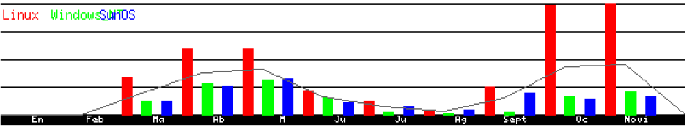

## ETSII y el software libre

La ETSII (antiguo Centro Superior de Informática) desde su inicios, en 1990, siempre ha utilizado SL asociado a sus sistemas informáticos unixs (HP-UX y Solaris). El sistema operativo GNU/Linux en sus inicios fue introducido para permitir que los PCs pudieran conectarse en modo gráfico a los servidores Sun. Poco a poco ha ido ganando mas relevancia como sistema operativo autónomo, convirtiéndose hoy en día en el mas utilizado en las aulas de informática, con un 65% de los accesos, seguido muy por detrás por Soraris (21%) y Windows (14%). En la Figura 3 se muestra la evolución de los accesos en parte de los meses del año 2002.

**Figura 3:** Uso de los distintos sistemas operativos en las salas del centro de cálculo ETSII

Un factor clave que determinó el aumento de utilización de GNU/Linux y el SL fue el abandono de los servidores Novell, en el año 2001\. Hasta entonces dichos servidores se encargaban de soportar al sistema operativo MS-DOS, que era el utilizado para impartir las asignaturas descritas en el apartado anterior. Las alternativas existentes era migrar hacia Windows o hacia GNU/Linux.

También dentro de la ETSII y otros centros de la ULL existen miembros de Grupo de Usuarios de Linux de Canarias (GULiC) que siempre han prestado su apoyo a iniciativas de promoción del SL.

A raíz de la organización de una fiesta de instalación de GNU/Linux se creó una lista de distribución dentro de la ULL. Hoy en día en esa lista sus miembros discuten sobre SL y organizan iniciativas en apoyo de éste. Entre los proyectos e iniciativas relacionadas con la Universidad [4] en que han colaborado miembros de esta lista destacamos:

* Elaboración de un dossier sobre el apoyo de la Universidad de La Laguna hacia el SL y recogida de firmas.
* Curso y libro CILA: Anualmente se organizan, auspiciados por la Facultad de Matemáticas, unos cursos de Introducción al Linux para Alumnos (CILA). En ese marco se ha elaborado un libro con colaboraciones de toda España.
* Distintas conferencias, talleres, proyecciones, fiestas de instalación y mesas redondas relacionados con el SL.
* Creación de Guachinche::Live CD [9]: una distribución de GNU/Linux que puede arrancar desde el CD-ROM.
* Portal de la futura Oficina del Software Libre (OSL) de la ULL.
* Lebrillo: Web para la gestión de proyectos relacionados con el SL.

El apoyo al SL dentro de la ULL es notable entre sus miembros, como así lo atestigua las mas de 300 firmas recogidas en la primera iniciativa, que pedía a los candidatos a Rector en las elecciones del 2003 que dieran también su apoyo institucional. Es de destacar dentro de dichas firmas el predominio de miembros de la ETSII, donde se encuentran gran parte de los expertos informáticos de la ULL, y por tanto conocedores de lo que el SL significa.

Lamentablemente, y a pesar de las promesas electorales, el apoyo con el que cuenta el SL entre los miembros de la ULL no se ha aún conseguido que sea asumido por las instituciones.

