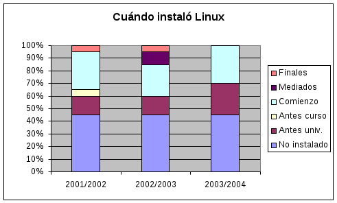
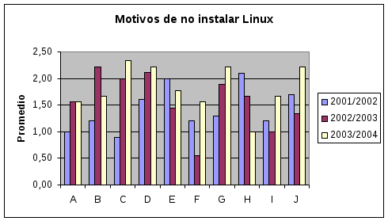
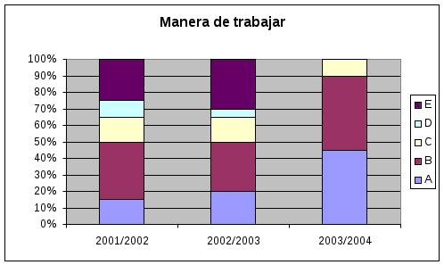
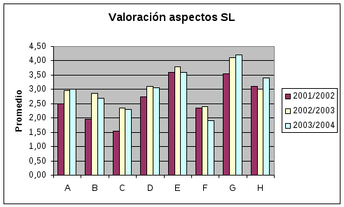
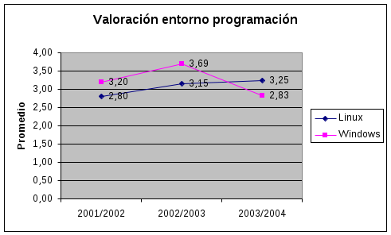
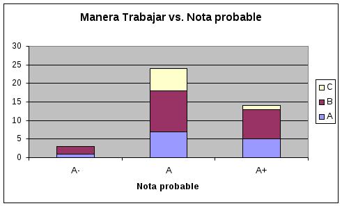
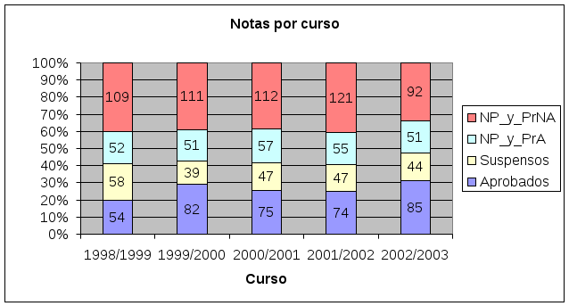

## Resultados

**Figura 4:** Respuestas a la pregunta “¿Cuándo instalaste Linux por primera vez?”

En la Figura 4 podemos ver como el número de alumnos que no ha instalado Linux se ha mantenido en torno a un 45%. Desde el curso 2003/2004 esta situación en ya no es tan grave debido a la utilización de Guachinche, que no necesita instalación. Por otro lado el número de alumnos que a comienzos de curso ya tenían instalado Linux se ha incrementado en este último curso.

**Figura 5:** Respuestas a la pregunta “Valora los motivos de porqué no has instalado Linux”

Entre los motivos de por qué los alumnos no instalan Linux, Figura 5, podemos destacar la necesidad de expertos en instalación (A: “No se instalarlo”, C: “No he encontrado a nadie que me eche una mano” e I: “He intentado instalarlo pero no lo he conseguido”). Además, de la respuesta B (“No me atrevo a instalarlo”) se aprecia como los alumnos han ido perdiendo el miedo en el último año a la instalación del Linux, posiblemente debido al aumento de las facilidades para la instalación.

También es de destacar el incremento en el último curso los resultados de la respuesta G (“No creo necesario instalarlo”), creemos que es debido a las nuevas posibilidades de trabajar con Guachinche sin necesidad de instalación.

**Figura 6:** Respuestas a la pregunta “Manera habitual en que trabajas las prácticas”

En cuanto a la manera de trabajar en el desarrollo de programas, Figura 6, las respuestas A (“Todo en Linux”) y B (“Primero compilo con el Free Pascal para Windows/dos, luego la paso al Free Pascal para Linux”) son las mas ortodoxas, mientras que las restantes (C, D y E) suponen utilizar compiladores que no son el Free Pascal (posiblemente de Borland). Se observa que en este último curso ha aumentado la proporción de alumnos que trabajan únicamente en Linux (hasta un 45%) mientras que los restantes aún han de pasar por Windows al menos en fase de edición.

**Figura 7:** Respuestas a la pregunta “Cómo valoras los siguientes aspectos en la utilización del entorno de programación Linux”

Entre los aspectos mas valorados en del SL (Figura 7) podemos destacar el hecho de su gratuidad (E: “La gran cantidad de herramientas gratuitas existentes” y G: “El que Linux sea totalmente gratuito”). Como menos valorado tenemos la comodidad de uso y su utilidad en la calle (C y F).

**Figura 8:** Respuestas a la pregunta “Valoración de los entornos de programación que conozcas”

Respecto a la valoración del entorno de programación Linux respecto al de Windows vemos como Linux ha venido ganando popularidad hasta llegar en el último curso a superar a Windows, ver Figura 8.

**Figura 9:** Relación entre las respuestas a las preguntas “Manera habitual en que trabajas las prácticas” y “¿Qué nota (posiblemente) obtendrás en prácticas?”

Para valorar si la manera de trabajar esta relacionada con la nota final de prácticas esperada se correlacionaron estos dos aspectos. Observándose que dentro del número de alumnos que obtienen notas altas hay mayor proporción de los que trabajan íntegramente en Linux (A), aunque las diferencias no son significativas.

Finalmente para comprobar si la migración ha afectado a los resultados académicos en la Figura 10, y las ya vistas Figuras 1 y 2, se muestran dichos resultados para los cursos desde 1998/1999 hasta 2002/2003 (aún no tenemos los resultados del presente curso). Se observa como apenas se producen ligeras diferencias entre aprobados, suspenso, no presentados con prácticas aptas (NP_y_PrNA) y no presentados con prácticas no aptas (NP_y_PrA).

**Figura 10:** Proporcion de notas academicas entre los cursos 1998/1999 y 2002/2003

